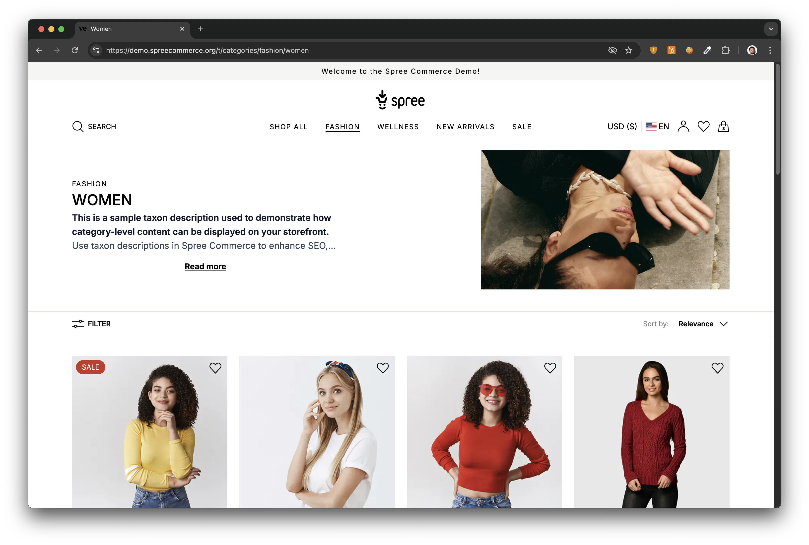
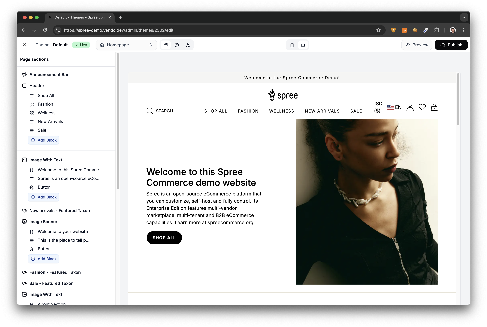

# Spree Rails Storefront

[](https://badge.fury.io/rb/spree_storefront)

A modern, fully-featured Ruby on Rails storefront for [Spree Commerce](https://spreecommerce.org), with an integrated visual page builder for creating custom pages and managing themes.

This repository contains two gems:

- **[spree_storefront](storefront/)** — Responsive storefront with product catalog, cart, checkout, and customer accounts
- **[spree_page_builder](page_builder/)** — Visual page builder and theme management for the storefront

## Tech Stack

- [Ruby on Rails](https://rubyonrails.org/)
- [Tailwind CSS v4](https://tailwindcss.com/) — Responsive, mobile-first design
- [Turbo / Hotwire](https://turbo.hotwired.dev/) — Fast, SPA-like navigation
- [StimulusJS](https://stimulus.hotwired.dev/) — JavaScript controllers for interactivity
- [Importmaps](https://github.com/rails/importmap-rails) - NodeJS not required

## Installation

Add the storefront gem to your Spree application (this automatically installs the page builder):

```bash
bundle add spree_storefront
```

Then run the install generator:

```bash
bin/rails g spree:storefront:install
```

This will set up the storefront views, Tailwind CSS configuration, and page builder migrations.

You will also need to create your first theme:

```bash
Spree::Store.default.send(:create_default_theme)
```

## Features

### Storefront



- Product catalog with filtering and search
- Shopping cart with guest persistence
- Multi-step checkout (address, shipping, payment)
- Customer accounts, order history, wishlists
- SEO optimization with meta tags and structured data
- Automatically cropping, resizing, and optimizing images for performance, CDN-ready

### Page Builder



- Visual editor for creating custom pages
- Theme management with multiple themes per store
- 23+ pre-built page sections (headers, footers, product grids, image banners, etc.)
- Content blocks (text, images, buttons, navigation)
- Live preview with in-place editing

## Documentation

- [Storefront Customization](https://spreecommerce.org/docs/developer/storefront)
- [Theming Guide](https://spreecommerce.org/docs/developer/storefront/themes)
- [Page Builder](https://spreecommerce.org/docs/developer/storefront/pages)
- [CSS Customization](https://spreecommerce.org/docs/developer/storefront/custom-css)

## Headless Alternative

Check out our [Next.js Starter](https://github.com/spree/spree-nextjs-starter) with React 19, TypeScript and Tailwind CSS.

You can also use the [Spree API](https://spreecommerce.org/docs/developer/api-reference) and [SDK](https://github.com/spree/spree/tree/main/packages/sdk) to build your own storefront or mobile app.

## Development

```bash
# Run storefront tests
cd storefront
bundle install
bundle exec rake test_app
bundle exec rspec

# Run page builder tests
cd page_builder
bundle install
bundle exec rake test_app
bundle exec rspec
```

## License

- **spree_storefront** is licensed under the [MIT License](storefront/LICENSE.md)
- **spree_page_builder** is licensed under the [AGPL-3.0-or-later License](page_builder/LICENSE.md)
